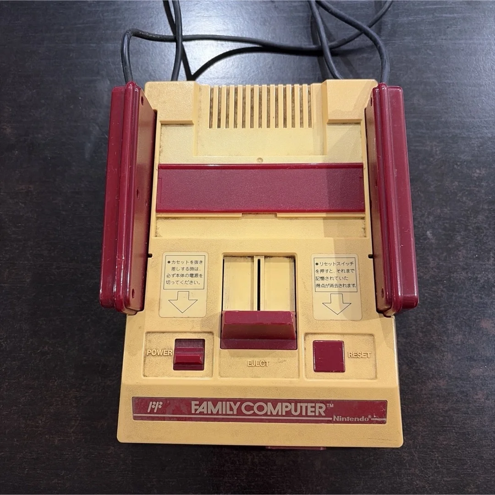
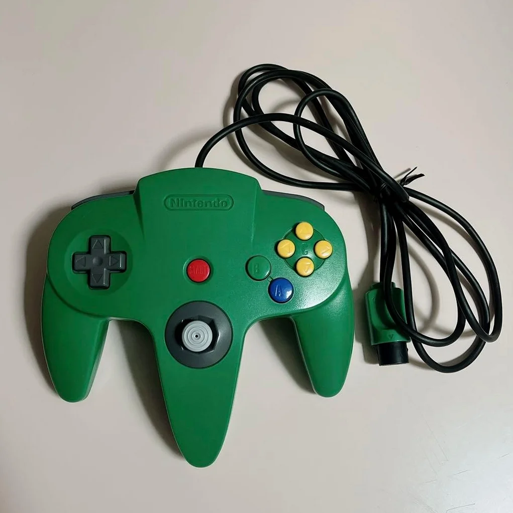
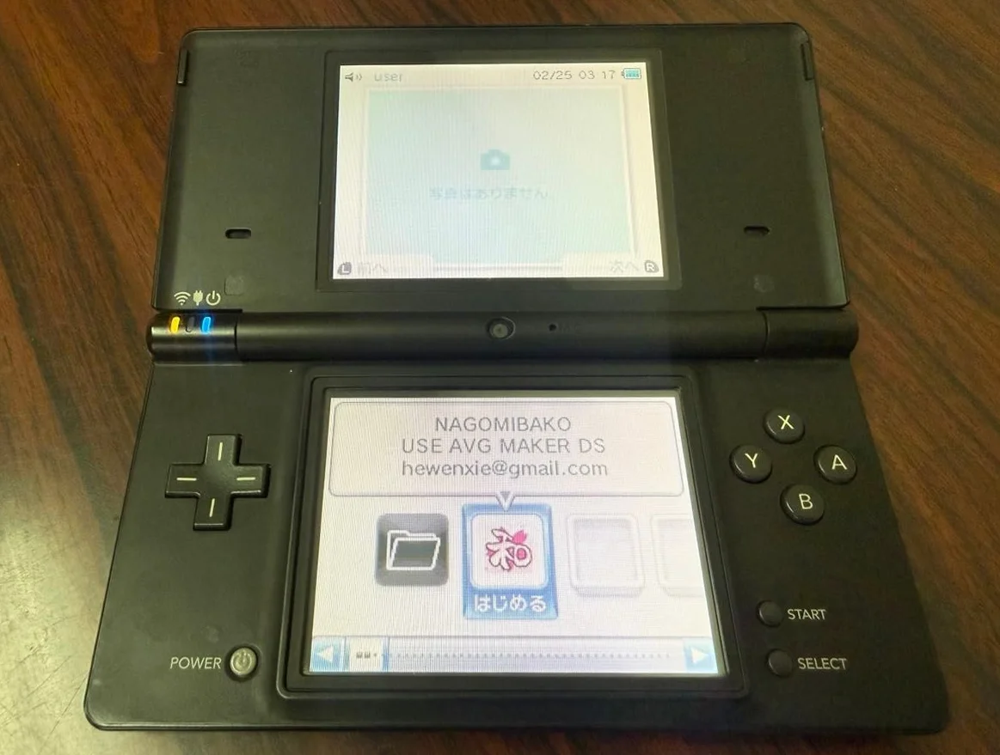

# Gallery / My Collection

Welcome to Retro Console First Aid Guide's image gallery! Featuring beautiful photos of classic gaming consoles.

---

## Nintendo Entertainment System (NES)

*NES Console*

*NES Console - Another Angle*

---

## Super Nintendo (SNES)

*Super Nintendo Console*

*Super Nintendo Gundam Limited Edition - Front View*

---

## Nintendo 64

*Nintendo 64 Console*

*Nintendo 64 Controller*

---

## GameCube

*GameCube Orange Transparent Console*

*GameCube Transparent Controller*

---

## Wii

*Wii White Console*

---

## Game Boy Pocket

*Game Boy Pocket Transparent Purple*

---

## Nintendo DS

*Nintendo DS Lite Black*

---

## Nintendo 3DS

*Nintendo 3DS Coral Pink*

---

## About This Gallery

This page showcases:

- 🎮 Physical photos of classic consoles
- 🔧 Disassembly photos during repairs
- 📸 Collector's prized possessions
- 🏆 Before/after restoration comparisons

---

## Submission Guidelines

If you have precious console photos to share, submit via our [Contact Us](contact.md) page!

### Submission Requirements

1. Clear images, minimum 800×600 resolution
2. Original photography or authorized use
3. Include console model and brief description
4. Supported formats: JPG, PNG, WebP

---

*Regularly updated...*