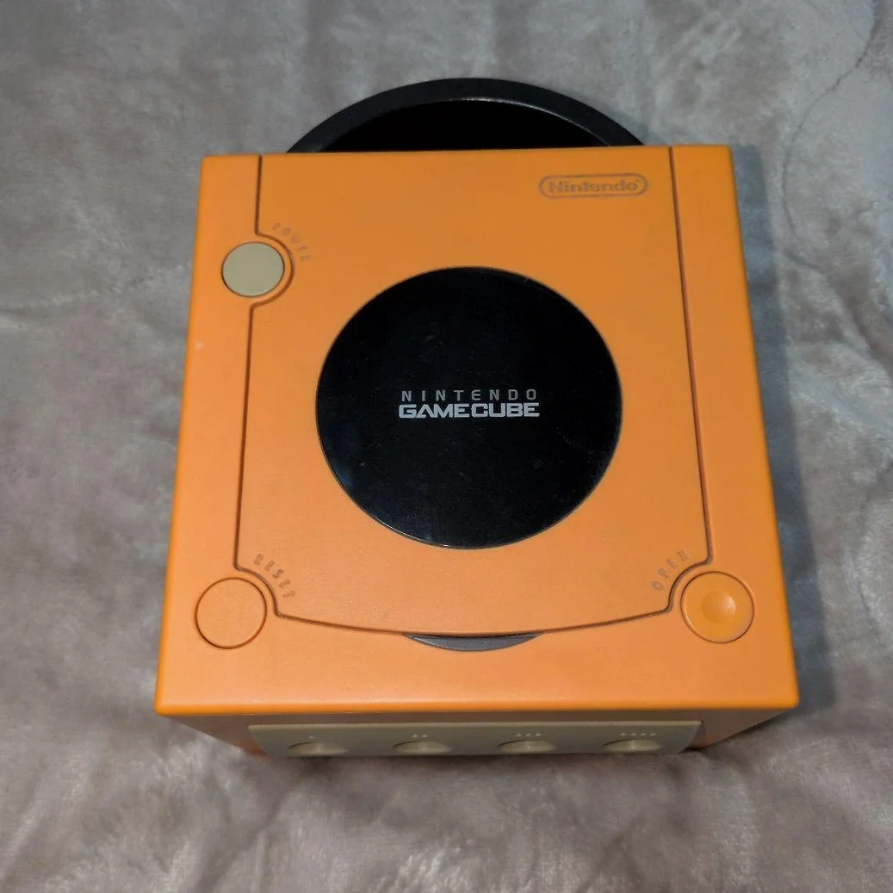

# GameCube 音频输出维修完全指南

> 你的GameCube突然没声音了，或者只有一边声道有声音，最恼火的是玩《塞尔达传说》时背景音乐断断续续！GameCube的音频系统相对简单，但AV接口氧化、电容老化、芯片损坏都会导致音频问题。别急着放弃，大多数音频问题都能修复！

## 所需工具
- 三角螺丝刀（Y字头），GameCube专用
- 十字螺丝刀，PH0规格
- 万用表，带通断测试功能
- 示波器（可选，但很有用）
- 电烙铁和焊锡
- 电容套装（音频专用）
- 电子清洁剂
- 棉签和异丙醇
- 音频测试线（3.5mm转RCA）
- 防静电手套

## 维修步骤

### 1. 拆机准备，定位音频相关电路
1. 拔掉所有线材，记住AV线位置
2. 卸下底部6颗三角螺丝（Y字螺丝刀）
3. 打开上盖，小心光驱排线
4. 找到主板上的音频相关部分：
   - AV接口（主板后部）
   - 音频处理芯片（通常标记为APU或Audio）
   - 音频输出电容（靠近接口）
   - 数字音频接口（DOL-001特有）

### 2. 音频系统架构分析
GameCube音频系统包含：
1. **音频处理器**：集成在GPU中的特制DSP
2. **数模转换器**：将数字音频转为模拟信号
3. **放大电路**：驱动AV接口输出
4. **滤波电路**：去除高频噪声
5. **输出接口**：AV多合一接口

### 3. 系统诊断流程
#### 第一步：接口检查
1. **AV接口检查**：检查针脚是否弯曲、氧化
2. **接口清洁**：用电子清洁剂喷入，棉签擦拭
3. **线缆测试**：用已知好的AV线测试
4. **电视测试**：换电视或输入接口测试

#### 第二步：信号追踪
用万用表追踪音频信号路径：
1. **AV接口针脚定义**：
   - 针脚1：视频信号
   - 针脚2：右声道音频
   - 针脚3：左声道音频
   - 针脚4：地线
2. **从接口往回查**：找到第一个元件（通常是电容）

#### 第三步：元件测试
重点测试以下元件：
1. **输出电容**：音频通路上的耦合电容
2. **电阻**：信号路径上的限流电阻
3. **电感**：滤波用的磁珠电感
4. **芯片**：音频处理相关芯片

### 4. 常见故障维修
#### 故障1：完全无声
1. 检查AV接口是否接触良好
2. 测试音频输出电容是否开路
3. 检查音频芯片供电是否正常
4. 测量音频芯片输出是否有信号

#### 故障2：只有单声道
1. 检查对应声道的输出电容
2. 检查对应声道的电阻
3. 检查AV线是否单边损坏
4. 检查音频芯片对应输出脚

#### 故障3：声音失真/杂音
1. 检查滤波电容是否失效
2. 检查电源滤波是否良好
3. 检查接地是否良好
4. 检查是否有干扰源

#### 故障4：声音断续
1. 检查电容是否漏电
2. 检查焊点是否虚焊
3. 检查芯片是否热稳定性差
4. 检查连接线是否接触不良

### 5. 电容更换指南
音频通路电容对音质影响很大：

#### 关键电容位置：
1. **输出耦合电容**：直接影响声音
2. **电源滤波电容**：影响信噪比
3. **芯片旁路电容**：影响芯片稳定性

#### 推荐电容规格：
- **输出耦合**：10μF 16V 音频专用电容
- **电源滤波**：100μF 16V 低ESR电容
- **旁路电容**：0.1μF 陶瓷电容

#### 更换步骤：
1. 记录原电容极性
2. 用吸锡器或热风枪拆除
3. 清理焊盘
4. 安装新电容，注意极性
5. 焊接并清洁

### 6. 芯片级维修
如果确定是音频芯片问题：

1. **芯片型号识别**：查找主板上的音频芯片
2. **供电测试**：测量芯片供电引脚电压
3. **信号测试**：用示波器测试输入输出信号
4. **芯片更换**：需要热风枪和植锡技巧

## 配件与价格参考

| 所需配件 | 参考价格 | 购买渠道 | 玩家建议 |
|---------|---------|---------|---------|
| 音频专用电容套装 | ¥20-40 | 电子市场 | 买日本化工或红宝石 |
| GameCube AV线 | ¥25-50 | 闲鱼/淘宝 | 原装线音质更好 |
| 音频测试线 | ¥15-30 | 音响店 | 带左右声道分离 |
| 电子清洁剂 | ¥20-35 | 维修工具店 | 接点复活剂 |
| 热风枪套装 | ¥150-300 | 淘宝 | 芯片维修需要 |

## GameCube音频技术细节

### 🎮 音频规格
- **处理器**：特制DSP，48kHz 16位
- **声道数**：立体声（部分游戏支持环绕）
- **输出电平**：标准线路电平
- **信噪比**：>90dB（原装状态）

### 🔊 输出接口类型
1. **AV多合一**：标准输出接口
2. **数字音频**：DOL-001特有，需要专用线
3. **RGB输出**：需要改装，音视频分离

### 🎵 音频特色
1. **硬件混音**：支持多声道实时混音
2. **音频流**：支持CD音质音频流
3. **环境音效**：部分游戏支持3D音效
4. **麦克风支持**：Mario Party等游戏

## 维修技巧与注意事项

### ⚠️ 安全注意事项
1. **静电防护**：音频芯片对静电敏感
2. **电容放电**：维修前给大电容放电
3. **焊接温度**：控制好温度，避免损坏板子
4. **测试安全**：先低压测试，再完全组装

### 🔧 专业技巧
1. **信号追踪**：从输出接口往回查
2. **电容测试**：用ESR表测试电容质量
3. **接地检查**：音频对接地很敏感
4. **屏蔽处理**：必要时加屏蔽层

## 维修难度：★★★★☆
## 预计耗时：2-3小时
## 成功概率：85%（电容问题），60%（芯片问题）

---

### 🎯 音频增强方案
修复后可以考虑增强：
1. **更换高级电容**：使用音频专用电容
2. **增加滤波**：加强电源滤波
3. **输出改造**：改为RCA独立输出
4. **数字输出**：利用数字音频接口

### 📊 音频系统寿命
- **电容寿命**：音频电容10-15年
- **芯片寿命**：半导体芯片20年以上
- **接口寿命**：取决于使用频率
- **最佳维护**：定期清洁接口

---

**玩家感悟**：GameCube的游戏音乐是一大亮点，《塞尔达传说：风之杖》的海浪声、《阳光马里奥》的欢快旋律、《银河战士Prime》的科幻音效。修好音频系统，重新听到这些经典配乐，那种感动难以言表。好的声音能让游戏体验提升一个档次。

**最后叮嘱**：如果更换电容后问题依旧，可能是芯片问题。GameCube的音频芯片很少单独损坏，多是外围元件问题。耐心排查，你的GameCube还能再唱20年！

---

### 🔍 进阶诊断：示波器分析
如果有示波器：
1. **信号波形**：检查音频信号是否完整
2. **噪声分析**：检查背景噪声水平
3. **频率响应**：测试不同频率信号
4. **失真分析**：检查谐波失真

### 🛠️ 数字音频解决方案
对于DOL-001型号：
1. **原装数字线**：价格昂贵但音质最好
2. **HDMI转换器**：现代电视解决方案
3. **光纤输出**：需要额外改装
4. **优点**：数字信号无损失，音质纯净