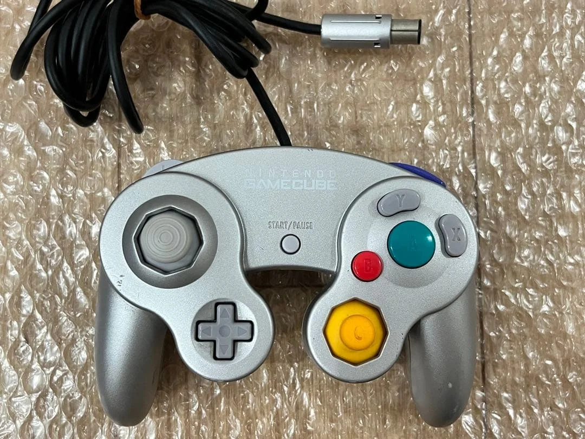

# Nintendo 64控制器外壳更换完全指南

## 概述

Nintendo 64控制器以其独特的三手柄设计和标志性的外形成为经典，但长期使用后外壳可能出现磨损、变色、裂纹或损坏。更换外壳不仅能恢复控制器外观，还能改善握持手感和使用体验。本指南详细介绍N64控制器外壳更换的全过程。

## N64外壳设计特点

### 独特的三手柄设计
1. **中央手柄**：主要握持区域，包含方向键和开始键
2. **左侧手柄**：包含A/B键和C方向键
3. **右侧手柄**：包含Z触发键和摇杆

### 外壳材质与结构
- **ABS塑料**：耐用但可能随时间变黄
- **多部件组装**：上下壳、手柄部件、按钮等
- **颜色变体**：多种官方颜色和限定版
- **卡扣固定**：主要依靠塑料卡扣，少量螺丝

## 外壳损坏类型

### 常见问题
- **表面磨损**：长期使用导致的涂层脱落
- **颜色变黄**：紫外线照射或化学物质影响
- **裂纹破损**：摔落或过度用力导致的物理损坏
- **卡扣断裂**：多次拆装或不当操作导致
- **螺丝孔滑丝**：螺纹损坏导致无法固定

### 特殊问题（N64特有）
- **手柄连接处裂纹**：三手柄设计的应力集中点
- **摇杆开口磨损**：摇杆活动导致的边缘磨损
- **Z键区域损坏**：扳机操作导致的局部应力

## 更换时机判断

✅ **建议更换的情况**：
- 外壳裂纹影响结构强度
- 严重变色影响美观和收藏价值
- 卡扣损坏导致外壳松动
- 计划进行控制器定制或改装
- 多个手柄部件同时损坏

❌ **不建议更换的情况**：
- 轻微表面划痕或使用痕迹
- 均匀的自然老化变色（怀旧感）
- 仅内部功能需要维修
- 原装外壳状态良好且有收藏价值

## 所需材料与工具

### 新外壳选择
- **原装拆机外壳**：最佳选择，完美兼容
- **第三方兼容外壳**：价格较低，质量参差不齐
- **透明外壳**：展示内部结构的流行选择
- **限定版颜色**：匹配特定N64主机颜色
- **3D打印外壳**：完全自定义设计

### 必备工具
- 十字螺丝刀（#00）
- 塑料撬棒套装（不同尺寸）
- 镊子（直头和弯头）
- 零件收纳盒（带分隔）
- 防静电腕带（推荐）

### 辅助材料
- 异丙醇（清洁用）
- 无绒布
- 标签贴纸（标记螺丝和部件）
- 手机或相机（记录拆解过程）

## 安全注意事项

⚠️ **重要警告**
1. N64控制器结构相对复杂，需要耐心操作
2. 注意塑料卡扣，避免使用金属工具强行撬动
3. 记录每个步骤，拍照辅助记忆
4. 妥善保管所有小零件，特别是弹簧和卡扣
5. 在干净宽敞的工作台操作

## 完整拆解流程

### 阶段一：初步拆解

#### 步骤1：螺丝拆除
1. 将控制器正面朝下放置
2. 定位所有外壳螺丝（通常6-8颗）
3. 注意螺丝可能有不同长度和类型
4. 将螺丝按位置分类存放并标记

#### 步骤2：外壳分离
1. 从手柄连接处开始分离
2. 使用塑料撬棒插入缝隙
3. 沿周边逐步松开所有卡扣
4. 注意三手柄连接处的特殊卡扣

### 阶段二：内部部件转移

#### 步骤3：主板拆卸
1. 断开所有内部连接：
   - 摇杆模块连接器
   - 按键膜连接器（如有）
   - Z键连接线
2. 移除主板固定点
3. 小心抬起主板，避免弯曲或损坏

#### 步骤4：按键系统转移
1. 取出导电橡胶组件
2. 分离C方向键按键帽
3. 取出A/B键结构
4. 拆卸开始键和方向键组件

#### 步骤5：摇杆模块处理
1. 拆卸摇杆模块固定结构
2. 注意模块方向和安装位置
3. 检查摇杆磨损情况
4. 清洁模块安装区域

#### 步骤6：Z触发键组件
1. 拆卸Z键微动开关
2. 取出扳机弹簧（小心弹出）
3. 检查扳机结构完整性
4. 清洁滑动轨道

### 阶段三：手柄部件分离（如需要）

#### 步骤7：三手柄分离
1. **中央手柄**：包含方向键和开始键
2. **左侧手柄**：包含A/B键和C方向键
3. **右侧手柄**：包含Z键和摇杆
4. 注意连接处的卡扣和定位柱

#### 步骤8：部件清洁和检查
1. 清洁所有拆下的部件
2. 检查每个部件的完整性
3. 准备转移到新外壳

### 阶段四：新外壳准备

#### 步骤9：外壳检查
1. 检查新外壳所有卡扣是否完好
2. 测试螺丝孔螺纹是否正常
3. 检查外壳表面有无瑕疵或变形
4. 对比原装外壳尺寸和结构

#### 步骤10：外壳清洁
1. 使用异丙醇清洁内部所有表面
2. 去除生产过程中的脱模剂
3. 清洁所有螺丝孔和卡扣槽
4. 检查并清除注塑毛边或飞边

## 组装到新外壳

### 步骤11：内部部件安装

#### Z触发键安装
1. 安装Z键微动开关到新外壳
2. 放置弹簧和扳机结构
3. 测试扳机滑动顺畅度
4. 确保触发功能正常

#### 摇杆模块安装
1. 将模块放入新外壳安装位置
2. 对齐所有固定点和螺丝孔
3. 安装固定结构
4. 测试摇杆活动范围

#### 主板安装
1. 将主板放入新外壳
2. 对齐所有安装柱和定位点
3. 连接所有内部连接器
4. 确保主板平整无弯曲

#### 按键系统安装
1. 安装导电橡胶组件
2. 放置A/B键结构
3. 安装C方向键按键帽
4. 安装开始键和方向键组件

### 步骤12：手柄部件组装（如需要）

#### 三手柄对接
1. 先对接中央手柄和左侧手柄
2. 再对接右侧手柄
3. 确保所有卡扣正确对齐
4. 测试连接牢固度

### 步骤13：外壳闭合

#### 对齐技巧
1. 先对齐三手柄连接处
2. 确保所有内部线缆位置正确
3. 从中央开始向四周逐步合拢
4. 听到所有卡扣到位的清脆声音

#### 螺丝安装
1. 先用手将螺丝拧入几圈
2. 按照对角线顺序逐渐拧紧
3. 避免过度用力导致滑丝或塑料开裂
4. 检查外壳缝隙是否均匀一致

## 功能测试与校准

### 基础功能测试
1. **连接测试**：
   - 连接控制器到N64主机
   - 进入系统设置→控制器设置
   - 测试主机识别和基础通信

2. **按键测试**：
   - 测试所有按键单次按压
   - 测试快速连按响应
   - 测试多键同时按压

3. **摇杆测试**：
   - 测试全方向移动
   - 测试回中精度
   - 测试活动顺畅度

4. **Z键测试**：
   - 测试触发响应
   - 测试扳机手感
   - 测试弹簧回弹

### 游戏内测试
1. **平台游戏测试**：
   - 《超级马里奥64》测试移动和跳跃
   - 检查摇杆精度和响应

2. **动作游戏测试**：
   - 《塞尔达传说：时之笛》测试菜单和瞄准
   - 检查C方向键功能

3. **格斗游戏测试**：
   - 《任天堂明星大乱斗》测试连招
   - 检查所有按键响应速度

### 手感与人体工学测试
1. **握持舒适度**：
   - 测试每个手柄的握感
   - 检查边缘是否刮手
   - 评估长时间使用舒适度

2. **按键手感**：
   - 测试按键压力和行程
   - 检查按键声音
   - 评估整体操作感

3. **平衡性测试**：
   - 测试控制器重量分布
   - 检查操作时的稳定性
   - 评估游戏中的控制感

## 常见问题与解决方案

### 问题1：外壳闭合不严或缝隙不均
**原因**：卡扣未完全对齐、内部部件干涉、外壳变形
**解决**：重新打开检查，确保所有卡扣正确对齐，移除干涉部件

### 问题2：按键无响应或响应异常
**原因**：导电橡胶未安装到位、连接器未插紧、电路问题
**解决**：重新安装按键系统，检查所有连接，测试电路

### 问题3：摇杆活动受限或卡滞
**原因**：外壳内部有干涉、模块安装不正、清洁不彻底
**解决**：检查摇杆周围间隙，重新安装模块，彻底清洁

### 问题4：Z键功能异常
**原因**：弹簧安装不当、微动开关问题、扳机结构干涉
**解决**：重新安装弹簧，测试微动开关，检查扳机活动

## 定制改装建议

### 外观定制
1. **颜色定制**：
   - 喷漆改色（需要专业设备和技术）
   - 贴膜改色（相对简单）
   - 购买预涂装外壳

2. **透明外壳**：
   - 展示内部结构
   - 可添加LED灯效
   - 流行改装选择

3. **图案定制**：
   - 丝印或水转印图案
   - 贴纸装饰
   - 雕刻图案

### 功能增强
1. **现代摇杆**：
   - 更换为GameCube风格摇杆
   - 安装霍尔效应摇杆
   - 改善精度和寿命

2. **额外功能**：
   - 添加连发功能
   - 增加震动功能（需要主板改造）
   - 无线改装（高级项目）

3. **人体工学改进**：
   - 改善握把形状
   - 增加防滑处理
   - 调整按键布局

## 成本与时间评估

### 成本分析
- 第三方兼容外壳：¥80-150
- 原装拆机外壳：¥120-250
- 透明或定制外壳：¥150-300
- 工具成本：¥100-200（一次性）

### 时间预估
- 熟练者：60-90分钟
- 初学者：120-180分钟
- 包括测试和调整：额外30分钟

### 成功率
- 简单更换：90%
- 包含部件维修：80%
- 定制改装：70%

## 维护与保养

### 日常维护
1. **清洁保养**：
   - 定期清洁外壳表面
   - 使用专用塑料清洁剂
   - 避免腐蚀性化学品

2. **使用保护**：
   - 避免摔落和撞击
   - 不要过度用力操作
   - 使用后妥善存放

### 存储建议
1. **环境控制**：
   - 干燥环境存放
   - 避免阳光直射
   - 温度适宜（15-25°C）

2. **物理保护**：
   - 使用专用保护盒
   - 避免堆压重物
   - 定期检查状态

## 总结

Nintendo 64控制器外壳更换是一项中等难度的DIY项目，需要耐心和细心。通过本指南的步骤，即使是初学者也能成功完成更换工作，让经典的N64控制器焕然一新。

关键要点：
1. 理解N64独特的三手柄设计结构
2. 耐心细致，记录每个拆解步骤
3. 选择质量可靠的外壳和部件
4. 彻底测试确保所有功能正常

掌握这项技能后，你不仅可以修复损坏的控制器，还可以进行个性化定制，让你的N64控制器成为真正的个人收藏品。

---

**最后更新**：2026年3月1日  
**适用型号**：所有Nintendo 64原装控制器  
**难度等级**：中级  
**建议经验**：有一定电子产品拆装经验  
**特别提醒**：N64控制器结构相对复杂，建议先观看拆解视频了解结构