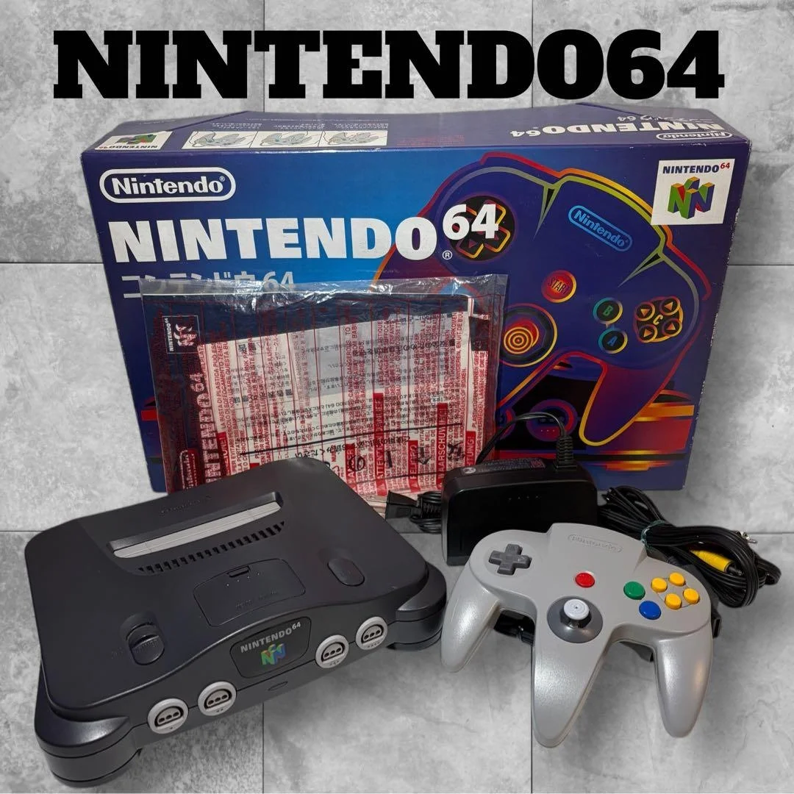

# Nintendo 64 LED状态灯更换完全指南

> 你的N64"失明"了？开机时那个熟悉的红色指示灯不亮了，或者闪烁异常？LED状态灯虽然小，却是N64的"心跳指示灯"。它不亮，你不知道主机是否通电；它异常闪烁，可能暗示着电源问题。别小看这颗小灯，更换它能让你的N64重新"睁眼"！

## 所需工具
- 十字螺丝刀，4.5毫米游戏机专用
- 塑料撬棒，避免划伤外壳
- 电烙铁和焊锡，25-40W为宜
- 吸锡器或吸锡线，拆除旧LED
- 万用表，检测电路通断
- 镊子，处理小元件
- 放大镜或头戴式放大镜
- 防静电手环（可选）

## 维修步骤

### 1. 诊断LED问题
1. 开机测试：观察LED是否完全不亮
2. 亮度测试：是否变暗或闪烁
3. 颜色测试：是否变色（正常应为红色）
4. 电路测试：用万用表检测LED两端电压
5. **重要**：确认是LED损坏而非电路问题

### 2. 拆卸主机访问LED
1. 卸下底部6颗螺丝（2颗在脚垫下）
2. 分离上下外壳，注意卡扣
3. 找到LED位置：在上盖前端右侧
4. 断开LED排线：从主板上轻轻拔下
5. 取出上盖，露出LED组件

### 3. 拆卸旧LED
1. 观察LED安装方式：直插或贴片
2. **直插式LED**：通常有两个引脚
3. 用电烙铁加热焊点，用镊子取下LED
4. 用吸锡器清理焊孔
5. **注意极性**：记住LED的正负极方向

### 4. 准备新LED
1. **规格匹配**：3mm红色LED，电压2.0-2.2V
2. **亮度选择**：标准亮度即可，避免过亮
3. 测试新LED：用3V电池测试是否发光
4. 确认极性：长脚为正极，短脚为负极
5. 适当修剪引脚长度

### 5. 焊接新LED
1. 插入LED：注意极性正确
2. 先焊接一个引脚固定
3. 检查位置：LED是否对准导光柱
4. 焊接另一个引脚
5. 检查焊点：应光滑饱满，无虚焊
6. 清理助焊剂残留

### 6. 测试与组装
1. 连接排线，暂时不上螺丝
2. 开机测试：LED应正常亮起
3. 亮度测试：是否适中，不刺眼
4. 稳定性测试：连续开关机几次
5. 完全组装：装回外壳，上紧螺丝

## 配件与价格参考

| 所需配件 | 参考价格 | 购买渠道 | 玩家点评 |
|---------|---------|---------|---------|
| 3mm红色LED | ¥1-5/个 | 电子市场 | 买多个备用 |
| LED套装 | ¥10-20 | 淘宝 | 各种颜色尺寸 |
| 电烙铁套装 | ¥50-100 | 五金店 | 25-40W最适合 |
| 焊锡丝 | ¥10-20 | 电子市场 | 0.8mm含松香 |
| 吸锡器 | ¥15-25 | 工具店 | 手动式就够用 |
| 放大镜台灯 | ¥80-150 | 文具店 | 焊接小元件必备 |

## 老玩家经验库

### 🎮 LED状态灯的意义
1. **电源指示**：告诉你主机已通电
2. **工作状态**：常亮表示正常工作
3. **故障提示**：闪烁可能表示问题
4. **怀旧元素**：红色小灯是N64的标志

### 🔧 LED常见故障原因
- **自然老化**：LED寿命约5-10万小时
- **过流损坏**：电路问题导致电流过大
- **物理损坏**：撞击或挤压导致
- **焊点脱焊**：长期热胀冷缩导致
- **电路板问题**：限流电阻损坏

### 💡 LED个性化改造
1. **颜色改造**：换成蓝色、绿色、白色
2. **亮度调整**：更换限流电阻调整亮度
3. **呼吸灯效果**：增加电路实现呼吸效果
4. **双色LED**：不同状态显示不同颜色
5. **RGB LED**：可编程变色效果

## 维修难度：★★☆☆☆
## 预计耗时：1-2小时（含学习焊接时间）
## 成功概率：90%（焊接需要一些练习）

---

### 📚 冷知识：N64 LED的"设计哲学"
1. **红色选择**：90年代电子设备常用红色指示灯
2. **亮度控制**：通过限流电阻控制亮度，保护LED
3. **位置设计**：右上角，符合人机工程学
4. **导光设计**：塑料导光柱让光线均匀柔和

### 🎯 LED维修的细节要点
1. **极性最重要**：接反了LED不亮，但通常不损坏
2. **温度控制**：焊接时间不超过3秒，避免热损坏
3. **亮度适中**：太亮刺眼，太暗看不清
4. **颜色准确**：保持原装红色，保持怀旧感
5. **可靠性第一**：焊点要牢固，避免日后脱焊

### 🔍 如何判断LED是否需要更换
- **完全不亮**：最常见，直接更换
- **变暗**：老化迹象，建议更换
- **闪烁**：可能是LED问题，也可能是电路问题
- **变色**：从红变橙或变暗红，需要更换
- **时亮时不亮**：接触不良，需要重新焊接

### 🌟 LED升级改造方案
1. **超亮LED**：提升可见度，但可能刺眼
2. **低功耗LED**：减少发热，延长寿命
3. **慢闪LED**：待机时缓慢闪烁，很酷
4. **双LED**：增加一个LED，更醒目
5. **遥控变色**：通过遥控器改变颜色

### ⚠️ 安全注意事项
1. **断电操作**：焊接时一定要断开电源
2. **防静电**：敏感元件，注意静电防护
3. **通风良好**：焊接烟雾有害，保持通风
4. **工具安全**：电烙铁高温，小心烫伤
5. **儿童远离**：小零件防止误吞

---

**玩家心声**：N64的红色小灯可能只有米粒大小，但它是整台主机的"灵魂之窗"。每次开机看到它亮起，就知道冒险即将开始。更换LED就像给老伙计做一次"眼科手术"，虽然操作精细，但成功后看到那熟悉的红光再次亮起，仿佛听到了《超级马里奥64》的开场音乐："It's-a me, Mario!" 有些光芒，值得永远点亮。