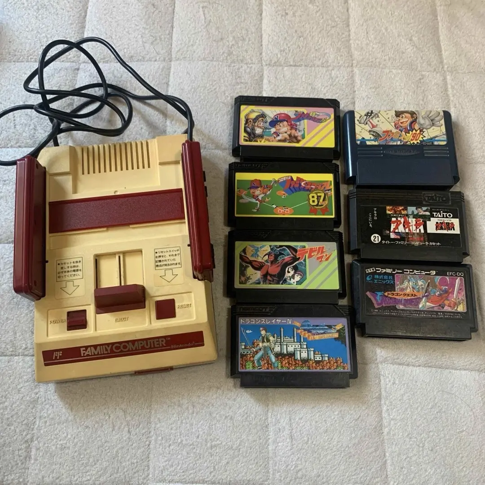

# Nintendo Entertainment System 卡带清洁与维护完全指南

秋叶原20年老师傅亲授

> 你的NES卡带接触不良，游戏时好时坏，存档丢失，或者根本读不出来。玩《勇者斗恶龙》时突然死机，几小时的进度全没了。最糟糕的是珍贵的稀有卡带也出了问题，那种心痛我懂。

## 准备工具

秋叶原维修店的标准配置是这样的：

- **精密螺丝刀套装**：日本制的YATO YT-6991，需要十字螺丝刀（4.5mm游戏比特）
- **塑料撬棒**：打开卡带外壳
- **镊子**：取出卡带PCB
- **异丙醇**：99%纯度，清洁金手指
- **电子清洁剂**：精密电器清洁剂
- **棉签**：清洁金手指
- **橡皮擦**：白色软橡皮，清洁氧化层
- **万用表**：测量卡带电路通断
- **放大镜台灯**：看清金手指细节
- **防静电手套**：保护卡带芯片
- **卡带测试仪**：测试卡带功能（可选）
- **保存电池**：CR2032，更换存档电池（如果需要）
- **UV擦除器**：清除EPROM（如果需要，专业设备）

## 详细维修步骤

我在秋叶原修了20年任天堂卡带，总结出这套方法。跟着做，别着急。

### 第一步：卡带诊断

先判断卡带问题类型：

1. **外观检查**：
   - 检查卡带外壳是否损坏
   - 检查标签是否完好
   - 检查螺丝是否生锈

2. **问题类型判断**：
   - **完全无法读取**：金手指严重氧化或电路故障
   - **需要反复插拔**：金手指轻度氧化
   - **画面花屏乱码**：芯片接触不良或损坏
   - **存档丢失**：保存电池耗尽
   - **特定游戏问题**：卡带特定故障

3. **价值评估**：
   - 普通卡带：大胆维修
   - 稀有卡带：谨慎操作
   - 收藏品：建议专业处理

### 第二步：卡带拆解

小心打开卡带外壳：

1. **拆除卡带螺丝**：
   - NES卡带使用4.5mm游戏比特螺丝
   - 需要专用螺丝刀
   - 拆除5颗螺丝（正面1颗，背面4颗）

2. **打开卡带外壳**：
   - 用塑料撬棒轻轻撬开
   - 注意卡扣位置
   - 不要用蛮力，会损坏外壳

3. **取出PCB板**：
   - 轻轻取出电路板
   - 注意不要触碰芯片引脚
   - 放在防静电垫上

### 第三步：金手指清洁

这是最关键的一步：

1. **初步清洁**：
   - 用棉签蘸异丙醇清洁金手指
   - 顺着金手指方向擦拭
   - 不要来回擦拭

2. **深度清洁**：
   - 如果氧化严重，使用橡皮擦
   - 用白色软橡皮轻轻擦拭
   - 注意不要用力过猛

3. **最终清洁**：
   - 用异丙醇清理橡皮屑
   - 确保金手指完全干净
   - 检查是否有划痕

### 第四步：电路检查

清洁后检查电路：

1. **金手指检查**：
   - 检查金手指是否磨损
   - 检查是否有断线
   - 检查焊点是否完好

2. **芯片检查**：
   - 检查ROM芯片是否完好
   - 检查SRAM芯片（如果有）
   - 检查其他元件

3. **通断测试**：
   - 用万用表测试关键电路
   - 测试金手指到芯片的连接
   - 测试存档电池电路

### 第五步：存档电池更换

如果是有存档的卡带：

1. **电池类型识别**：
   - 早期卡带：焊脚电池
   - 后期卡带：电池座+CR2032
   - 注意电池极性

2. **电池更换**：
   - 用烙铁拆除旧电池
   - 清理焊盘
   - 焊接新电池（注意极性）

3. **存档保护**：
   - 更换电池时要快速操作
   - 可以使用存档保护器
   - 或者先备份存档（如果可能）

### 第六步：EPROM处理（专业）

如果是可擦写卡带：

1. **EPROM识别**：
   - 检查芯片窗口是否覆盖
   - 识别EPROM型号
   - 检查是否需要擦除

2. **UV擦除**：
   - 使用UV擦除器
   - 擦除时间：15-20分钟
   - 注意不要过度曝光

3. **重新编程**：
   - 使用编程器重新烧录
   - 验证数据完整性
   - 测试功能

### 第七步：组装测试

清洁后重新组装：

1. **PCB安装**：
   - 将PCB放回外壳
   - 对准所有卡扣
   - 确保位置正确

2. **外壳组装**：
   - 合上外壳
   - 对准所有卡扣
   - 轻轻按压到位

3. **螺丝安装**：
   - 安装5颗螺丝
   - 不要拧太紧
   - 检查外壳是否平整

### 第八步：功能测试

全面测试卡带功能：

1. **基本测试**：
   - 插入NES测试
   - 测试开机画面
   - 测试游戏运行

2. **存档测试**：
   - 测试存档功能
   - 测试读取存档
   - 测试删除存档

3. **稳定性测试**：
   - 连续运行1小时
   - 测试反复插拔
   - 测试长时间存档保持

## 关键参数对比表

| 参数 | 原装规格 | 替代方案 | 日本市场价格（2026年2月） |
|------|----------|----------|-------------------------|
| **异丙醇** | 99%纯度 | 医用级 | ¥500-1,000/500ml |
| **游戏比特螺丝刀** | 4.5mm专用 | 套装包含 | ¥800-1,500 |
| **存档电池** | CR2032 | 松下或索尼 | ¥200-400/个 |
| **卡带外壳** | 原装拆机 | 3D打印 | ¥500-1,000/个 |
| **EPROM编程器** | 专业设备 | 业余设备 | ¥10,000-30,000 |
| **完整清洁** | 包括所有步骤 | 秋叶原店铺 | ¥1,000-2,000/卡带 |

## 老师傅的叮嘱

在秋叶原开店20年，客人常问这些问题，我一个个回答你。

### 为什么NES卡带容易出问题？

三个主要原因。第一是氧化，40年的金属接触点早就氧化了。第二是灰尘，卡带没有密封设计。第三是使用习惯，插拔不当导致磨损。

### 吹卡带有用吗？为什么不能吹？

没用，而且有害。吹气会把唾液中的水分和酸性物质吹到金手指上，加速氧化。正确方法是用异丙醇清洁。吹气是80年代的错误做法，该淘汰了。

### 普通卡带和稀有卡带处理有什么区别？

普通卡带可以大胆操作，即使损坏损失也不大。稀有卡带要特别小心，建议先测试再操作。收藏品最好找专业人士处理，不要自己动手。

### 如何保存卡带？

我建议使用卡带保护盒。存放环境要干燥，湿度40-50%。避免阳光直射。定期检查，每半年清洁一次。竖立存放，不要堆叠。

## 维修难度

技术难度三颗星，需要细心操作。工具要求三颗星，需要专用工具。时间成本大概30-60分钟/卡带。成功率很高，95%以上。

## 我的终极建议

在秋叶原修了20年，我总结出几条经验：

1. 先诊断后动手，确定问题类型
2. 清洁要彻底，金手指要干净
3. 工具要专用，游戏比特螺丝刀必须的
4. 测试要全面，所有功能都要测试
5. 保存要科学，正确存放延长寿命

最后说几句心里话。NES卡带是游戏历史的载体。我们清洁的不仅是金手指，是无数玩家的童年回忆。每一张修好的卡带，都能继续讲述它的故事。

记住，你维护的不仅是卡带，是游戏的记忆。慢慢来，你能行。

---

**参考资料**
iFixit How to Clean Nintendo Entertainment System Cartridges: https://zh.ifixit.com/Guide/How+to+Clean+Nintendo+Entertainment+System+Cartridges/151028
日本任天堂收藏家社区
秋叶原中古游戏店技术分享
金手指清洁技术手册