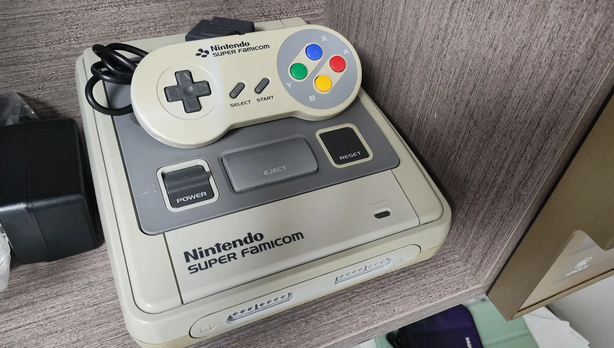

# Super Nintendo Cartridge Battery Replacement Complete Guide

## Overview

Super Nintendo (SNES) game cartridges typically contain a CR2032 coin cell battery for saving game progress. Over time, these batteries deplete, causing game save loss. This guide details how to safely replace SNES cartridge batteries.

## Required Tools

- Phillips screwdriver (#00 or #0)
- Flathead screwdriver or plastic spudger
- New CR2032 coin cell battery
- Solder and soldering iron (optional, some cartridges require soldering)
- Flux
- Desoldering pump or desoldering wick
- Anti-static wrist strap (recommended)

## Safety Precautions

1. **Static protection**: Always wear anti-static wrist strap or regularly touch grounded metal when handling cartridge circuit boards
2. **Battery polarity**: Note battery positive/negative orientation, incorrect installation may damage circuits
3. **Soldering safety**: If using soldering iron, ensure well-ventilated workspace, avoid burns
4. **Preserve original state**: Photograph original state before disassembly for later reassembly

## Detailed Steps

### Step 1: Disassemble Cartridge Shell

1. Use Phillips screwdriver to remove screws from cartridge back (usually 3-6)
2. Carefully separate cartridge top and bottom shell halves
3. Avoid excessive force to prevent damaging plastic clips

### Step 2: Locate Battery

1. Remove circuit board from cartridge
2. Find coin cell battery on circuit board (usually at board corner)
3. Observe battery installation method:
   - Soldered type: Battery fixed to circuit board via two solder points
   - Clip type: Battery installed in battery holder, can be directly removed

### Step 3: Replace Battery

#### For soldered batteries:
1. Heat positive battery solder point with soldering iron
2. Remove solder with desoldering pump or wick
3. Repeat for negative solder point
4. Carefully remove old battery
5. Clean pads, ensure surface clean
6. Place new battery with correct polarity (positive side up)
7. Solder battery positive, then negative
8. Check solder secureness, no shorts

#### For clip-type batteries:
1. Gently pry battery with flathead screwdriver
2. Remove old battery
3. Place new battery with correct polarity into holder
4. Ensure battery fully seated

### Step 4: Testing and Assembly

1. Test cartridge function before full assembly:
   - Insert cartridge into SNES console
   - Start game, attempt to save progress
   - Power off and restart, check if save successful

2. If test normal:
   - Return circuit board to shell
   - Align top and bottom shells
   - Tighten all screws

3. If test fails:
   - Check battery polarity correct
   - Check solder secureness
   - Check circuit board for damage

## Common Issues and Solutions

### Issue 1: Save still lost after battery replacement
- **Possible cause**: Poor battery contact or incorrect polarity
- **Solution**: Recheck battery installation, ensure good contact

### Issue 2: Circuit board damaged during soldering
- **Possible cause**: Iron temperature too high or dwell time too long
- **Solution**: Use temperature-controlled iron, solder quickly

### Issue 3: Cartridge shell damaged
- **Possible cause**: Excessive force during disassembly
- **Solution**: Use plastic spudger, apply force slowly and evenly

## Maintenance Suggestions

1. **Regular checks**: Recommend checking battery status every 5-8 years
2. **Quality choice**: Choose high-quality CR2032 batteries for longer lifespan
3. **Save backup**: Important game saves recommend external device backup
4. **Professional help**: If unfamiliar with soldering, recommend seeking professional assistance

## Technical Specifications

- **Battery model**: CR2032 3V coin cell battery
- **Typical lifespan**: 5-10 years (depends on usage frequency)
- **Save current**: Approximately 3-5 microamps
- **Operating temperature**: -20°C to +70°C

## Summary

Replacing SNES cartridge batteries is relatively simple maintenance but requires care and patience. Following this guide's steps, you can successfully restore cartridge save function, letting classic games continue accompanying you. Remember safety first, if unfamiliar with soldering, recommend practicing on other discarded circuit boards first.

---
*Last updated: February 28, 2026*  
*Reference source: iFixit Super Nintendo Cartridge Battery Replacement Guide*