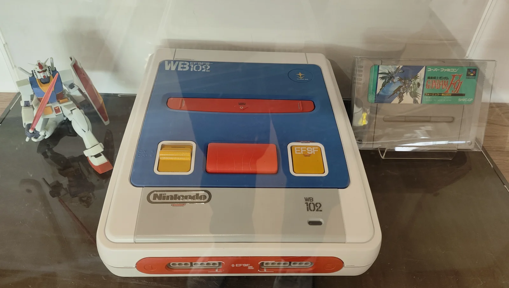

# Super Nintendo弹出按钮更换完全指南

## 概述

Super Nintendo（SNES）的弹出按钮（Eject Button）位于主机正面，用于轻松取出游戏卡带。由于长期使用，这个按钮可能出现磨损、卡滞或完全失效的问题。本指南将详细介绍如何诊断和更换SNES的弹出按钮。

## 所需工具

- 十字螺丝刀（#00和#1号）
- 平头螺丝刀或塑料撬棒
- 镊子
- 新的SNES弹出按钮（确保兼容性）
- 异丙醇和棉签
- 硅基润滑剂（可选）
- 防静电腕带（推荐）

## 安全注意事项

1. **断电操作**：确保SNES主机完全断电，拔掉所有连接线
2. **静电防护**：处理内部部件时佩戴防静电腕带
3. **小心塑料件**：SNES外壳塑料可能变脆，拆卸时避免用力过猛
4. **部件保存**：拆卸时将所有螺丝和零件放在安全位置
5. **拍照记录**：拆卸前拍照，记录原始装配方式

## 诊断步骤

在决定更换按钮前，先确认问题性质：

### 步骤1：问题分析
1. **测试按钮功能**：
   - 按下按钮，观察卡带弹出机制是否顺畅
   - 注意按钮手感：是否卡滞、松动或完全无反应

2. **常见症状**：
   - **按钮卡住**：按下后无法弹回
   - **按钮松动**：摇晃主机时有响声
   - **功能失效**：按下按钮但卡带不弹出
   - **手感异常**：按下时需要异常大力

### 步骤2：外部检查
1. **视觉检查**：
   - 观察按钮是否有裂纹、磨损
   - 检查按钮周围是否有异物卡住
   - 观察按钮位置是否偏斜

2. **清洁测试**：
   - 用棉签蘸异丙醇清洁按钮周围
   - 用压缩空气吹出可能卡住的灰尘
   - 测试按钮功能是否改善

### 步骤3：内部检查（如果需要）
如果外部清洁无效，可能需要打开主机检查：
1. 按钮弹簧是否损坏或丢失
2. 按钮机构是否有磨损
3. 卡带弹出机制是否正常

## 更换步骤

### 步骤1：拆卸主机外壳

1. **准备工作**：
   - 拔掉所有连接线（电源、视频、控制器）
   - 将主机放在柔软、防静电的工作面上
   - 准备容器存放螺丝

2. **卸下底部螺丝**：
   - 使用#1十字螺丝刀卸下主机底部的所有螺丝
   - SNES通常有6-7颗底部螺丝
   - 注意螺丝长度可能不同，记录位置

3. **分离外壳**：
   - 小心地抬起上壳
   - 注意上壳可能有卡扣连接
   - 如果有内部连接线（电源开关、复位按钮），先断开它们

### 步骤2：访问弹出按钮

1. **定位按钮组件**：
   - 弹出按钮位于主机正面右侧
   - 按钮通常与外壳一体或单独组件

2. **识别按钮类型**：
   - **早期型号**：按钮可能是外壳的一部分
   - **后期型号**：按钮可能是独立组件
   - 观察按钮的固定方式

### 步骤3：拆卸旧按钮

#### 情况A：按钮是外壳的一部分
如果按钮与上壳一体：

1. **检查损坏程度**：
   - 如果只是轻微磨损，可能不需要更换整个外壳
   - 如果按钮断裂，需要更换整个上壳

2. **更换上壳**：
   - 购买兼容的SNES上壳替换件
   - 将内部所有部件移植到新外壳
   - 注意按钮机构的对齐

#### 情况B：按钮是独立组件
如果按钮可以单独更换：

1. **解除固定**：
   - 观察按钮的固定方式（卡扣、螺丝或胶粘）
   - 使用塑料撬棒小心解除卡扣
   - 如果使用螺丝，卸下固定螺丝

2. **取出旧按钮**：
   - 轻轻摇动按钮使其松动
   - 注意可能有弹簧或其他小部件
   - 用镊子取出所有相关零件

3. **清洁安装区域**：
   - 用异丙醇清洁按钮安装座
   - 清除所有旧胶残留物
   - 检查安装座是否完好

### 步骤4：安装新按钮

1. **准备新按钮**：
   - 检查新按钮是否与旧按钮尺寸相同
   - 测试按钮动作是否顺畅
   - 如果需要，清洁新按钮

2. **安装弹簧（如果有）**：
   - 如果按钮使用弹簧，先安装弹簧
   - 确保弹簧方向正确
   - 测试弹簧张力

3. **安装按钮**：
   - 将按钮对准安装位置
   - 轻轻按压直到卡入到位
   - 如果使用螺丝，拧紧固定螺丝（不要过紧）

4. **润滑（可选）**：
   - 如果按钮动作不够顺畅，可少量使用硅基润滑剂
   - 仅在摩擦部位使用微量润滑剂
   - 避免润滑剂污染其他部件

### 步骤5：测试按钮功能

1. **手动测试**：
   - 多次按下按钮，测试动作是否顺畅
   - 检查按钮是否能完全弹回
   - 测试按钮行程和手感

2. **与弹出机制联动测试**：
   - 暂时安装卡带托盘或模拟卡带
   - 测试按钮按下时卡带弹出机制是否工作
   - 检查整个系统的协调性

### 步骤6：重新组装主机

1. **重新连接内部线缆**：
   - 连接之前断开的所有内部线缆
   - 确保连接牢固

2. **合上外壳**：
   - 对齐上下外壳
   - 确保所有卡扣正确对接
   - 避免夹住线缆

3. **拧紧螺丝**：
   - 按照原始位置安装所有螺丝
   - 对角线顺序均匀拧紧
   - 不要过度拧紧，避免损坏塑料螺纹

### 步骤7：最终测试

1. **功能测试**：
   - 连接电源和视频线
   - 插入游戏卡带
   - 测试弹出按钮功能：
     a. 按下按钮，卡带应顺利弹出
     b. 按钮应自动弹回原位
     c. 重复测试多次，确保稳定性

2. **全面检查**：
   - 检查主机所有功能是否正常
   - 测试电源开关、复位按钮
   - 测试控制器端口

## 常见问题与解决方案

### 问题1：新按钮卡滞
- **可能原因**：尺寸不匹配或安装不当
- **解决方案**：检查按钮尺寸，重新安装，必要时轻微打磨

### 问题2：按钮无法弹回
- **可能原因**：弹簧丢失、损坏或安装错误
- **解决方案**：检查弹簧，确保正确安装

### 问题3：按钮按下但卡带不弹出
- **可能原因**：按钮与弹出机制连接问题
- **解决方案**：检查联动机构，确保正确连接

### 问题4：按钮松动
- **可能原因**：固定不牢或部件磨损
- **解决方案**：加强固定，或更换相关磨损部件

## 预防性维护

1. **正确使用**：
   - 按下按钮时使用适当力度
   - 不要用尖锐物体按压按钮
   - 避免在卡带弹出过程中强制停止

2. **定期清洁**：
   - 每3-6个月清洁按钮周围
   - 使用压缩空气清除灰尘
   - 检查按钮动作是否顺畅

3. **环境控制**：
   - 避免高温、高湿环境
   - 防止灰尘积累
   - 定期检查塑料部件是否老化

## 技术规格

- **按钮类型**：机械式按压按钮
- **材料**：ABS塑料（通常）
- **颜色**：灰色（与主机外壳匹配）
- **行程**：约2-3mm
- **操作力**：约50-100克力

## 专业技巧

1. **塑料处理**：
   - 老化的SNES塑料可能变脆，操作要格外小心
   - 使用塑料专用工具，避免金属工具划伤
   - 如果塑料卡扣断裂，可使用塑料焊接或专用胶水修复

2. **弹簧选择**：
   - 如果弹簧丢失，需要找到合适替代品
   - 测试弹簧张力，确保按钮能正常弹回
   - 记录弹簧规格，便于未来更换

3. **兼容性检查**：
   - SNES有不同型号（SNS-001，SNS-101等）
   - 确保按钮与您的型号兼容
   - 购买前确认部件编号或提供主机照片

## 替代方案

如果无法找到原装按钮：

1. **3D打印**：如果有3D打印机，可以打印替换按钮
2. **捐赠主机**：从损坏的SNES主机上拆取按钮
3. **定制制作**：使用合适材料手工制作按钮
4. **专业维修**：寻求专业游戏机维修服务

## 总结

更换SNES弹出按钮是一项相对简单的维修工作，主要挑战在于小心处理塑料部件和确保正确组装。通过本指南的步骤，您可以成功恢复按钮的正常功能。如果您的SNES型号较老或塑料部件脆弱，建议格外小心操作，或考虑寻求专业帮助。

---
*最后更新：2026年2月28日*  
*参考来源：iFixit Super Nintendo Eject Button Replacement Guide*