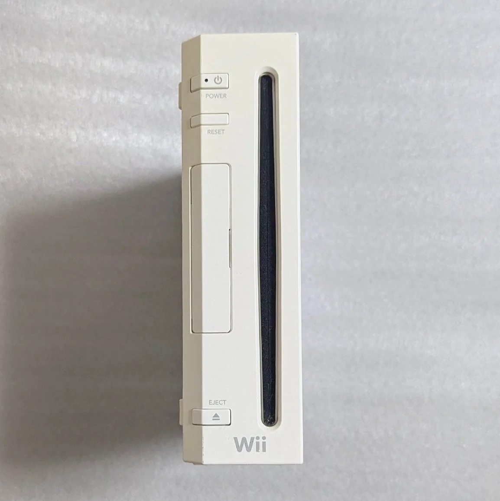

# Wii 光驱维修完全指南

> 你的Wii突然不读盘了，或者读盘声音巨大，最烦人的是玩《Wii Sports》时突然提示"光盘无法读取"！Wii的光驱设计相对耐用，但激光头老化、导轨磨损、皮带松弛是常见问题。别急着买新主机，大多数光驱问题都能修复！

## 所需工具
- 十字螺丝刀，PH0和PH00规格
- 三角螺丝刀（Y字头），Wii专用
- 精密镊子
- 无水酒精和超细棉签
- 光头功率调节螺丝刀（超小号）
- 强光手电筒
- 润滑脂（白色硅脂）
- 万用表（测试电机）
- 防静电手套

## 维修步骤

### 1. 安全拆机，取出光驱
1. 拔掉所有线材，记住传感器条和电源线位置
2. 卸下底部所有螺丝（注意隐藏螺丝在脚垫下）
3. 打开外壳，**小心WiFi和蓝牙天线**
4. 找到光驱组件——位于主机右侧的大模块
5. 断开光驱与主板的连接排线
6. 卸下固定光驱的螺丝，取出光驱总成

### 2. 光驱外观检查
1. **激光头检查**：检查透镜是否干净，有无划痕
2. **导轨检查**：检查光头移动轨道是否顺畅
3. **皮带检查**：检查进出仓皮带有无老化、松弛
4. **齿轮检查**：检查所有传动齿轮有无磨损
5. **电机检查**：检查主轴电机和进给电机

### 3. 清洁与基础维护
#### 激光头清洁：
1. 用吹气球吹去表面灰尘
2. 超细棉签蘸微量酒精
3. **轻轻点擦**透镜，Wii光头比NGC耐用但也要小心
4. 检查光头导轨，上微量润滑脂

#### 机械部分维护：
1. 清洁所有齿轮齿条
2. 检查皮带张力，必要时更换
3. 给所有运动部件上润滑脂
4. 检查光盘托盘轨道

### 4. 激光头功率调节（谨慎！）
如果清洁后仍不读盘：

1. 找到光头侧面的调节电位器
2. 用超小螺丝刀**顺时针**微调15-20度
3. 装回测试，读盘还不行就再调10度
4. **警告**：Wii光头调节范围比NGC大，但别超45度
5. 记录调节角度，便于后续参考

### 5. 电机测试与更换
#### 主轴电机测试：
1. 测量电机电阻，正常约10-20Ω
2. 直接给电机接3V电源测试转动
3. 检查电机轴是否顺畅

#### 进给电机测试：
1. 测量电机电阻，正常约50-100Ω
2. 测试电机带动光头移动
3. 检查限位开关是否正常

#### 更换电机：
如果电机损坏：
1. 购买同规格电机
2. 注意电机转向和电压
3. 焊接时控制温度和时间

### 6. 皮带更换指南
Wii光驱常用皮带规格：
- **进出仓皮带**：直径约24mm，截面1.5mm
- **建议**：购买原装或高质量替代品

更换步骤：
1. 拆除旧皮带
2. 清洁皮带轮
3. 安装新皮带，注意张力
4. 测试进出仓顺畅度

### 7. 组装与测试
1. 清洁光驱内部，去除灰尘
2. 安装回主机，连接所有线缆
3. **先不盖盖子测试**：观察光驱动作
4. 测试读盘：放入正版Wii游戏测试
5. 测试刻录盘：如果有使用刻录盘的习惯
6. 连续运行1小时，测试稳定性

## 配件与价格参考

| 所需配件 | 参考价格 | 购买渠道 | 玩家建议 |
|---------|---------|---------|---------|
| Wii光驱总成 | ¥80-150 | 闲鱼/淘宝 | 直接更换最省事 |
| Wii激光头 | ¥40-70 | 电子市场 | 买带架的，免调校 |
| 进出仓皮带 | ¥5-15 | 维修工具店 | 买一包多种规格 |
| 润滑脂 | ¥10-20 | 五金店 | 白色硅脂，别用黄油 |
| 三角螺丝刀 | ¥25-35 | 维修工具店 | Wii专用，必须的 |

## Wii光驱技术细节

### 🎮 光驱型号识别
- **D2C**：早期型号，光头较耐用
- **D2E**：中期型号，最常见
- **D3-2**：后期型号，光头寿命较短
- **D4**：最后期型号，兼容性最好

### 💿 支持的光盘类型
1. **Wii游戏光盘**：专用8cm小光盘
2. **GameCube游戏**：前提是主机支持（早期型号）
3. **DVD视频**：需要软破或硬改
4. **音乐CD**：需要软破

### 🔧 不同问题的表现
- **完全不读盘**：激光头或主板问题
- **读盘慢**：光头老化或导轨阻力大
- **读盘声音大**：机械部分需要润滑
- **偶尔读盘失败**：光头功率需要调节
- **不弹出光盘**：皮带或电机问题

## 维修技巧与注意事项

### ⚠️ 安全注意事项
1. **静电防护**：Wii主板对静电敏感
2. **光头保护**：不要用手触摸激光透镜
3. **调节谨慎**：功率调节要逐步进行
4. **测试顺序**：先测试再完全组装

### 🔧 专业技巧
1. **光头老化判断**：读刻录盘困难但读正版正常
2. **导轨润滑**：使用专用导轨润滑脂
3. **皮带张力**：不要太紧也不要太松
4. **电机测试**：用可调电源测试不同电压

## 维修难度：★★★☆☆
## 预计耗时：2-3小时
## 成功概率：80%（清洁维护），70%（更换光头）

---

### 🎯 替代方案：USB Loader
如果光驱实在修不好，可以考虑：
1. **软破**：安装Homebrew Channel和USB Loader
2. **硬破**：安装WiiKey等直读芯片
3. **优点**：从USB设备读取游戏，保护光驱
4. **缺点**：需要学习破解技术

### 📊 光驱寿命参考
- **原装光驱**：正常使用5-8年
- **激光头寿命**：约3000-5000小时
- **皮带寿命**：3-5年（高温环境更短）
- **最佳实践**：定期清洁，避免长时间连续运行

---

**玩家感悟**：Wii的光驱设计比GameCube进步了很多，但依然会老化。修好光驱，重新放入《Wii Sports》或《塞尔达传说：黄昏公主》，看着游戏顺利读取，那种成就感很棒。Wii的体感游戏是独一无二的体验，值得好好维护。

**最后叮嘱**：如果调节无效且更换光头太贵，可以考虑软破+USB Loader方案。现在Wii的破解非常成熟，是很好的替代方案。保护好你的Wii，它还能陪你玩很多年！

---

### 🔍 进阶诊断：示波器检测
如果你有示波器：
1. **检查RF信号**：光头读取时的眼图
2. **检查聚焦误差**：聚焦伺服信号
3. **检查循迹误差**：循迹伺服信号
4. **检查主轴速度**：光盘旋转稳定性

### 🛠️ 维修后的保养
1. **定期清洁**：每季度清洁一次光头
2. **避免灰尘**：保持主机周围清洁
3. **正确放置**：水平放置，避免震动
4. **光盘保养**：使用后放回盒中